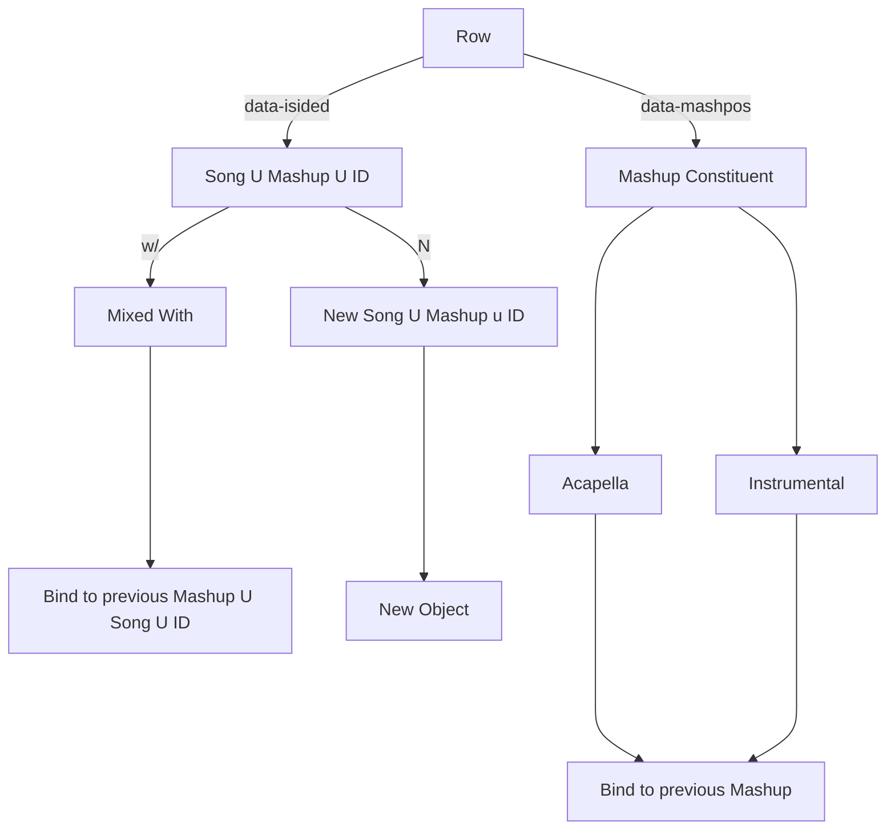

# The Goal of this Project

## Music is not Subjective. It is Non-deterministic

Music is said to be subjective. Some listeners find a song to be good, while others find a song to be bad. This has an intuitive meaning to all of us who listen to music. It is a delicate matter with a wide variety of cofounding variables. However, our hypothesis is that music is nondeterministic rather than subjective. Therefore, we can model a "good DJ set" with the concept of an event from probability theory. More specifically, we can model this event by introducing a sample space to capture all of the ambient sources of randomness. events are then modeled as measurable subsets of this sample space, and random variables are modeled as measurable functions on this sample space. [1] 

# Architecture 
## Original Approach
We have a wide variety of problems that must be solved:
1. How do we deal with missing data?
2. How do we deal with acapellas, instrumentals, and songs mixed with?
3. How do we find the section of the song played in the set?
    a. How do we find **where** the song was mixed in?
4. How can we develop a constant method for naming songs?

We cannot solve all of these in a semester, and so we will utilize an informal "quick and dirty" approach. 

## Current Approach
In our current approach, we augment the transformer architecture introduced by Vaswani et al. in their groundbreaking paper "Attention is all you Need" [2]. We utilize the same differentiable soft key/value store for predicting the next song in a sequence. Rather than represented words - or more abstractly atoms - as one-hot encoded vectors, as in [2], we represent our atoms as constant length continuous vectors. These are then learned by an embedding matrix. 
However, unlike in natural language processing, where two atoms are always mutually exclusive, we may have two atoms that are "mixed together" -- like when a Disc Jockey plays an accompaniement with an acapella (i.e., a remix). 
To counter-act this, we introduce a restriction on our data set:

In order to keep up with our quick and dirty approach, we **remove all songs that are not immediately available on spotify or soundcloud or any other form to the likings of**. Correspondingly, we introduce a secondary learning task to learn how to remix accompaniements with acapellas. 
Therefore, we have two learning tasks:
1. Learn a sequence of songs
2. Learn the remixes of songs

## Dataset
Music is parsed from [4] https://www.1001tracklists.com
To keep up with our quick and dirty spirit, we have a restrictions on our dataset:
1. The audio of the set - which may include crowd noise - is available

This requires us to utilize an algorithm that can filter out crowd-noise. Note that: https://mvsep.com
contains this.

 

So, here is an idea: utilize a byte-pair encoding algorithm over the continuous domain: [3]
Represent each song into a contextual embedding...

# Bibliography
[1] https://terrytao.wordpress.com/2015/09/29/275a-notes-0-foundations-of-probability-theory/
[2] https://arxiv.org/pdf/1706.03762
[3] https://arxiv.org/pdf/2301.11975
[4]

note that in the same way we have bindings for our parser in scheme, we will have bindings based on
our song type
POJOS:
{type = song | mashup | instrumental | acapella}
the key word: 'w/' => instrumental or acapella
while it looks back and there exists 'w/', bind...
until we reach an integer or a non- w/
*** Note we will need a highly consistent and concise grammar for searching songs in our library. ***
We will get meta data for our POJOS

{type: Mashup, acapellas: [], instrumentals: [], songs: []}
{type: Song, name: 'yyy', artist: 'xxx'}
Song, acapella, and instrumental are absorbing
Need to find a way to downoad tracks
        

may need to find soundcloud or spotify or youtube url and download: https://open.spotify.com/embed/track/3IRopjEQzdRC8oP98yUikY?theme=0
supporting all of these functionalities will be critical
Then we need to find what features we want to use from the song
Find the span element with the specific id
Notice our life is now easier, because there exists hidden elements that are a part of the mashup itself.
This will prove incredibly useful in our subproblem and larger over-arching problem

# dj_algorithm

### GIT
git pull origin <branch-name> --allow-unrelated-histories

## Further Resources
**OpenSource API for Identifying songs
https://rapidapi.com/dashydata-dashydata-default/api/shazam-song-recognition-api

**Set lists for DJs
https://www.mixesdb.com/w/Main_Page
