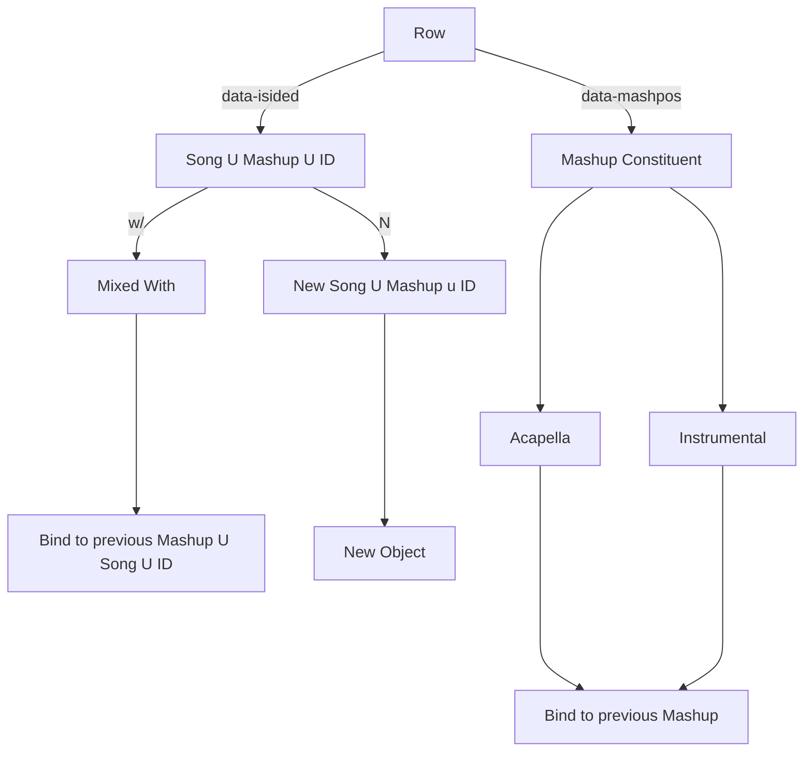

# The Goal of this Project

## Music is not Subjective. It is Non-deterministic

Music is said to be subjective. Some listeners find a song to be good, while others find a song to be bad. This has an intuitive meaning to all of us who listen to music. It is a delicate matter with a wide variety of cofounding variables. However, our hypothesis is that music is nondeterministic rather than subjective. Therefore, we can model a "good DJ set" with the concept of an event from probability theory. 

# Architecture 
## Original Approach
We have a wide variety of problems that must be solved:
1. How do we deal with missing data?
2. How do we deal with acapellas, instrumentals, and songs mixed with?
3. How do we find the section of the song played in the set?
    a. How do we find **where** the song was mixed in?
4. How can we develop a constant method for naming songs?

We cannot solve all of these in a semester, and so we will utilize an informal "quick and dirty" approach. 

## Current Approach
In our current approach, we augment the transformer architecture introduced by Vaswani et al. in their groundbreaking paper "Attention is all you Need" [1]. We utilize the same differentiable soft key/value store for predicting the next song in a sequence. 
However, unlike in natural language processing, where two atoms are always mutually exclusive, we may have two atoms that are "mixed together" -- like when a Disc Jockey plays an accompaniement with an acapella (i.e., a remix). 
This is one of the problems that will be solved this semester.

In order to keep up with our quick and dirty approach, we **remove all songs that are not immediately available on spotify or soundcloud or any other form to the likings of**. Correspondingly, we introduce a secondary learning task to learn how to remix accompaniements with acapellas. 
Therefore, we have two learning tasks:
1. Learn a sequence of songs
2. Learn the remixes of songs

## Dataset
Music is parsed from [2]
To keep up with our quick and dirty spirit, we have a restrictions on our dataset:
1. The audio of the set - which may include crowd noise - is available

### Misc Ideas
This requires us to utilize an algorithm that can filter out crowd-noise. Note that: https://mvsep.com
contains this.
So, here is an idea: utilize a byte-pair encoding algorithm over the continuous domain: [3]
Represent each song into a contextual embedding...

# Bibliography
[1] https://arxiv.org/pdf/1706.03762
[2] https://www.1001tracklists.com

# dj_algorithm

We hypothesize the existence of a seed that will dictate the timbre quality of the set. Our intuition is that all DJs share the same distribution of music at a very abstract level - one that is dissociated with the songs themselves. However, once a particular seed is chosen, the distribution becomes concrete and based on actual songs. 

We can think of it like the English language: at a very abstract level, you have the science behind the English language - things like grammar and vocabulary. But these are abstractions. What if we want to predict a certain poet's art over the English language? Their style, and what makes their words and the sequence of words so meaningful? We hypothesize that we can create an algorithm that will learn the grammar and spelling and other abstractions at a very high level, and then, based on the poet, convert this into poetry corresponding to that artist. Think of it like adding another layer to ChatGPT, where we now say "okay, you got the grammar down. Now make it art."
Essentially, we hypothesize a music theory behind DJing.
This could be useful:
https://learningtodj.com/blog/music-theory-essentials-for-djs-bars/

But how does one learn how to write in the first place? Newton tells us that we must stand on the shoulders of giants - we learn from predecessors! And we combine things based on what we like and our own past experiences into our own unique style. This is how a poet is born. So then what if we can take these seeds, along with some cleverness that is unknown now, and combine them and add them together in such a way that we mimic the creation of a new poet? This, is what Alan does. A poet of poets.

### GIT
git pull origin <branch-name> --allow-unrelated-histories

## Further Resources
**OpenSource API for Identifying songs
https://rapidapi.com/dashydata-dashydata-default/api/shazam-song-recognition-api

**Set lists for DJs
https://www.mixesdb.com/w/Main_Page

