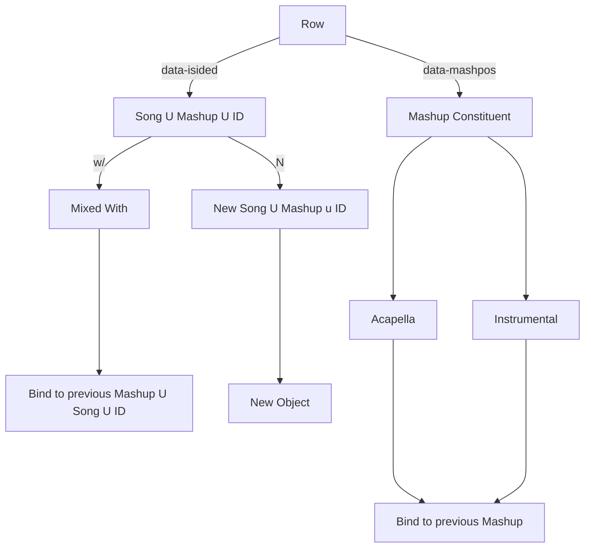

The important assumption is that any DJ who has consistently gained a lot of traction is considered a master at their profession. They have foresight that takes years to develop. We would like to interpret this mastery mathematically, at least part of it. That is the purpose of this project.

note that in the same way we have bindings for our parser in scheme, we will have bindings based on
our song type
POJOS:
{type = song | mashup | instrumental | acapella}
the key word: 'w/' => instrumental or acapella
while it looks back and there exists 'w/', bind...
until we reach an integer or a non- w/
*** Note we will need a highly consistent and concise grammar for searching songs in our library. ***
We will get meta data for our POJOS

{type: Mashup, acapellas: [], instrumentals: [], songs: []}
{type: Song, name: 'yyy', artist: 'xxx'}
Song, acapella, and instrumental are absorbing
Need to find a way to downoad tracks
        

may need to find soundcloud or spotify or youtube url and download: https://open.spotify.com/embed/track/3IRopjEQzdRC8oP98yUikY?theme=0
supporting all of these functionalities will be critical
Then we need to find what features we want to use from the song
Find the span element with the specific id
Notice our life is now easier, because there exists hidden elements that are a part of the mashup itself.
This will prove incredibly useful in our subproblem and larger over-arching problem

# dj_algorithm